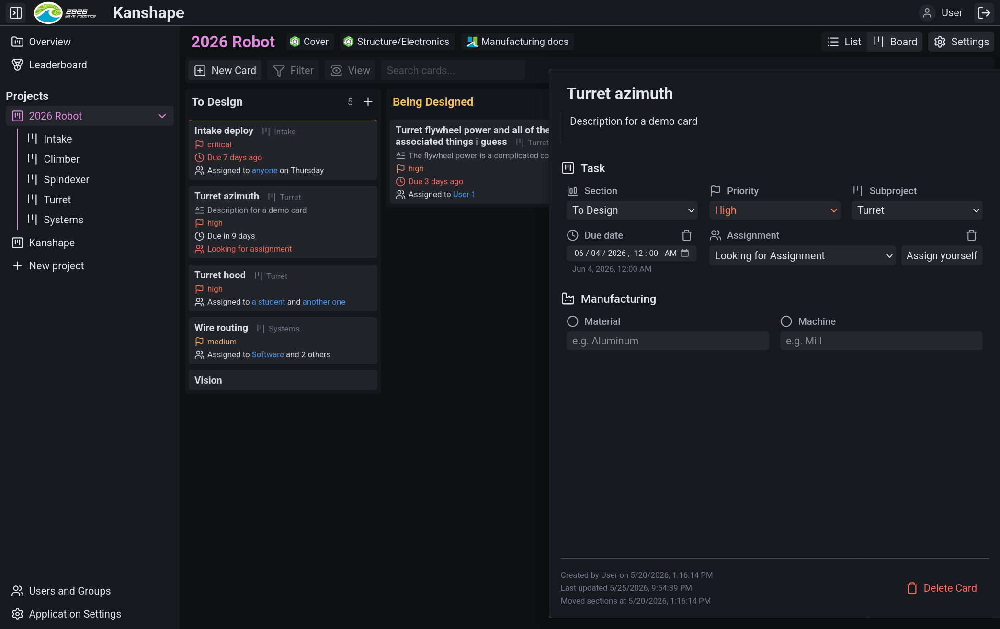
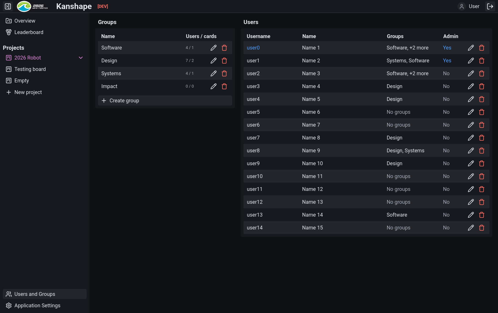
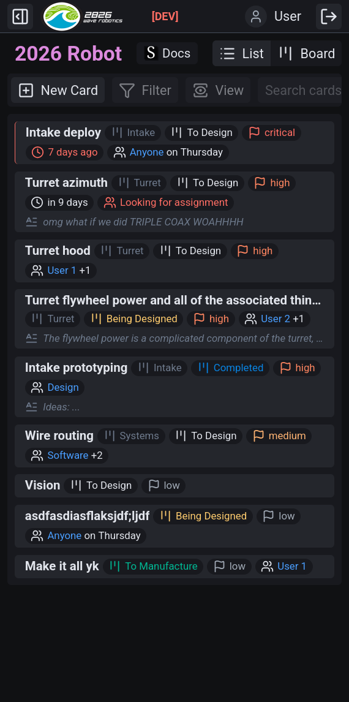

# Kanshape

A [Kanban board](https://en.wikipedia.org/wiki/Kanban_board) application to track subteams' work and part manufacturing timelines with tight [Onshape](https://www.onshape.com/) integration. Currently a heavy work-in-progress.

Work is split into projects, which include sub-projects for categorization (e.g. subsystems). Parts can be associated with a task directly through an Onshape side panel addon, and each Onshape document can have a Kanban tab showing active tasks.

Each kanban board has configurable categories for parts of the manufacturing pipeline. For example, "To CAM", "Shop Work", "To Print", and "Done". Tasks can be assigned to individuals, groups, or dates.

The scope extends a bit beyond Kanban:
- Inventory tracking (e.g. belts), mapping part to quantity per list
- Material stock tracking

## Features
- [x] User accounts with configurable SSO
- [x] Application configuration
- [x] Configurable projects and sub-projects (for e.g. subsystems)
- [x] Kanban boards with tasks
- [x] List view of tasks
- [x] User groups and management
- [x] Onshape panel/tab extension
- [x] Mobile responsiveness
- [x] Task due dates and assignment
- [x] Onshape document-level kanban view and linking
- [x] Documentation/other site linking
  - [ ] And embedded previews
- [ ] View filtering and search
- [ ] Manufacturing metadata and sub-tasks for production
- [ ] Card file uploads for artefacts like drawings, CAM files, etc.
- [ ] Onshape part detection and linking
- [ ] Email (and Slack?) notifications for task updates
- [ ] Leaderboard/productivity tracking
- [ ] Customizable per-project metadata
- [ ] Inventory and material stock tracking

> [!NOTE]
> **AI disclosure**  
> We care about the quality of this application! It is very intentionally **not** "vibe-coded". Though we're comfortable utilizing AI assistance as a tool, we've put a lot of care into making this application maintainable, performant, and user-friendly :)

## Early development preview

